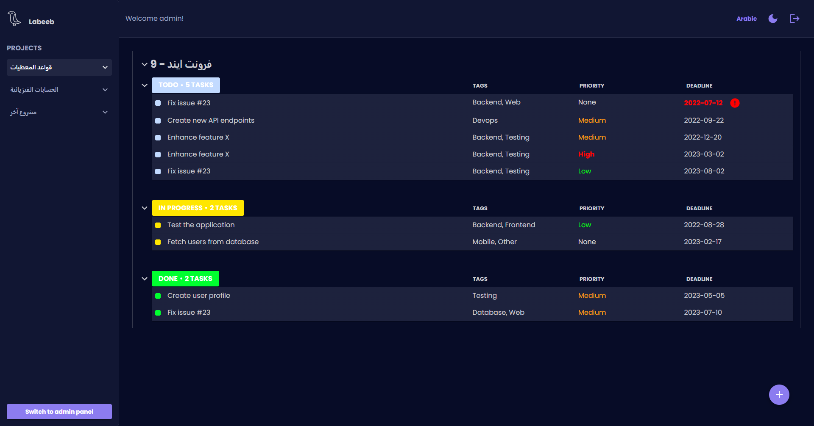
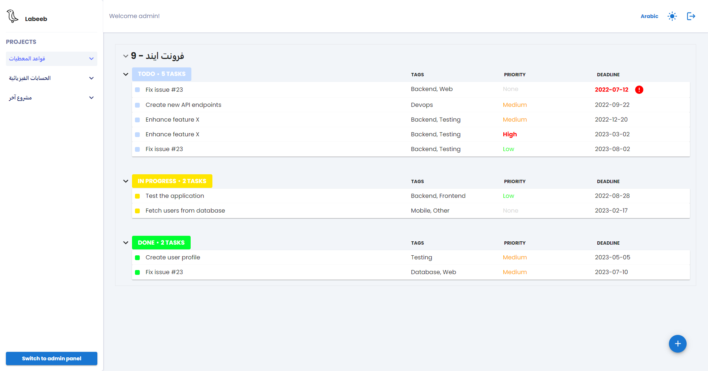
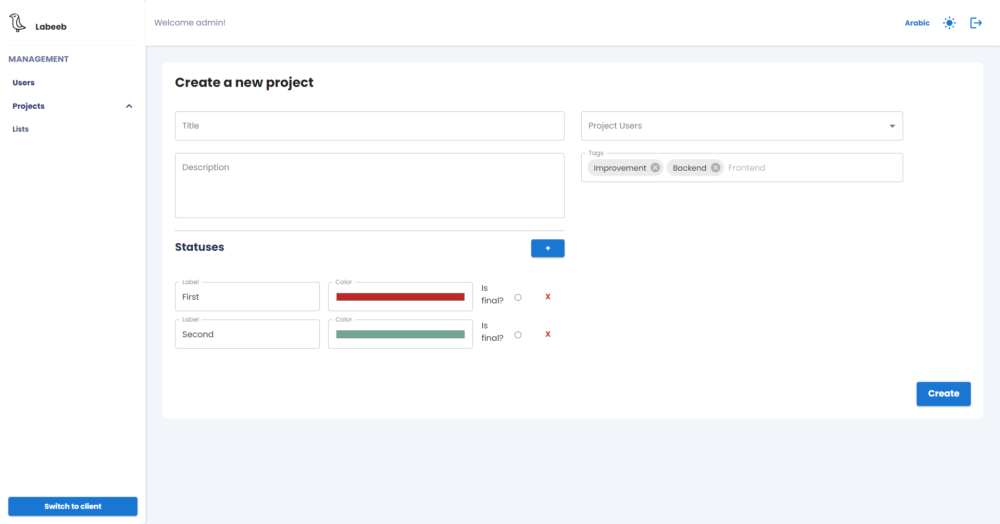
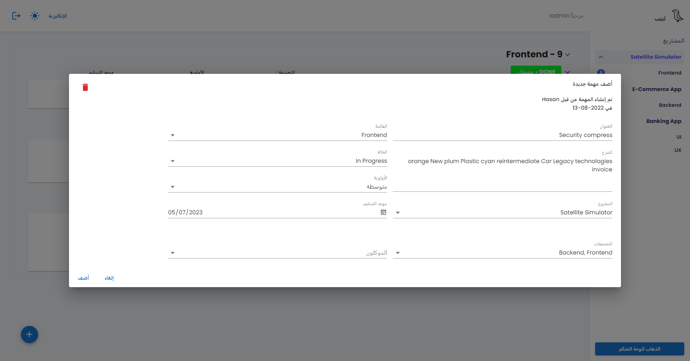
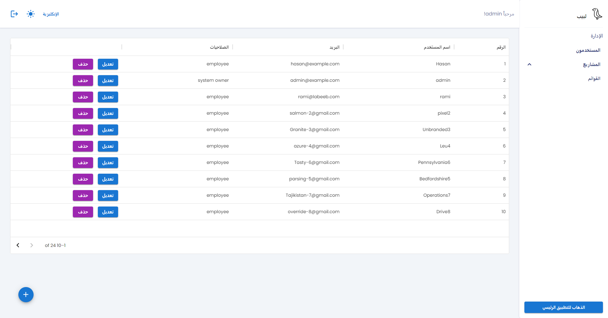

# Labeeb

An Arabic-first, open-source Tasks Management System created for Damascus University's third year project, Faculty of Information Technology.

## Features

- Arabic support
- Projects and tasks management
- Send email notifications to users on user creation, being added to a project, being assigned to a task, and when an assigned task's deadline is approaching
- A client application for managing tasks and an admin panel for projects and users
- Light/Dark modes
- Simple and easy to use interfaces

### Admin Panel

Projects consist of lists, each of which contains a number of tasks. In the admin panel, you can do CRUD operations on projects and lists, and you can also manage user accounts.

There are four roles for users of Labeeb:

1. Employee
2. Project Manager
3. Organization Manager
4. System Owner (only one user with this role)

### Client

On the client, normal users (employees) can view and manage their tasks.

The frontend is split into two parts:

- A client application for employees to view and manage their tasks
- An admin panel for managers to organize projects and tasks

## Screenshots







You can view the rest of the screenshots from the `screenshots` folder.

## Installation

Since the project has not been released yet, you have to install it from the source code.
And for now instructions will be only provided for development purposes.

### Installation for Development

1. Download the source-code into your machine.
   - Either by downloading it as a .zip and extracting it.
   - Or by cloning the repository using git.
2. Install Node.js 16.x or later versions on your machine.
3. Enable `corepack`:

   ```bash
   # Use an elevated shell (Administrator shell on Windows, sudo on Unix).
   corepack enable
   ```

4. Install all the workspace dependencies

   ```bash
   # Use a shell open at the root of the source-code.
   yarn
   ```

## Starting the development servers

> You can also use the vs-code tasks.

```bash
# Start frontend (client) development server and watch for changes.
yarn frontend

# Start backend server for development and watch for changes.
# Make sure to set up the database before doing this.
yarn backend

# You can also run this to check types on the frontend, since Vite emits
# the browser bundle even if there are TS errors/warnings.
yarn workspace client check-types
```

### Setting up the database

Before starting the backend server, make sure that your MariaDB instance is running.

On Windows, the easiest way is to use [XAMPP](https://www.apachefriends.org/). Here are the details steps:

1. Download XAMPP from the website provided above.
2. Install it on your machine.
3. Open the `xampp-control.exe` file and start the MySQL and Apache services.
4. Navigate to `localhost/phpmyadmin` in any browser.
5. Log in (username: root, password: '')
6. Create a new Database called 'Labeeb'
7. Spin up the backend server using `yarn backend`.

> Note: It isn't necessary to start the Apache service unless you want to access phpmyadmin.

> Although XAMPP calls it MySQL, it actualy uses MariaDB.

## Developing with Visual Studio Code

Open the workspace using the `labeeb.code-workspace` file from the root of the repository.
So vs-code can recognize the workspaces configuration properly.

### Focusing on a workspace

Collapse all the other workspaces you don't care about in the files panel,
and only expand the one you want.

### Tasks

Some tasks have been setup for basic operations.

They run commands properly at the right working directories so you can take advantage of them.

### Working with terminals

When starting a terminal, vs-code either opens it at the root of the **workspace** of the currently open file, or asks which workspace to use.

Pay attention to the working directory:

- It could be the project root `/labeeb/`.
- It could be the root of the backend `/labeeb/packages/server/`.
- It could be the root of the frontend `/labeeb/packages/client/`.
- It could be the root of any other package `/labeeb/packages/<package>/`.

Yarn commands work properly here:

- It will look for the command first at the closest package.json.
- Then will look for it at the project-level package.json.
- If the command has the format `<package>:<command>`, it'll look for it at the corresponding package.

You can also use the following format to run any command at workspace root:

```bash
yarn workspace <package> <command>
```

## Structure

This project was initialzied with `yarn berry` as a monorepo that consists of three packages:

- Client: The React.js frontend
- Server: The Nest.js backend
- Core: The shared types/interfaces between frontend and backend

### Tech stack

- Frontend: Vite, React.js, React-Query, React-Router, Zustand
- Backend: Nest.js, TypeORM

## Developers

- Frontend: [Hasan Mothaffar](https://github.com/HasanMothaffar)
- Backend: [Yaman Qassas](https://github.com/YamanQD)

Also special thanks to [Rami Sabbagh](https://github.com/Rami-Sabbagh) for helping out with setting up the environment, Yarn, translation, and the email service and scheduler.
